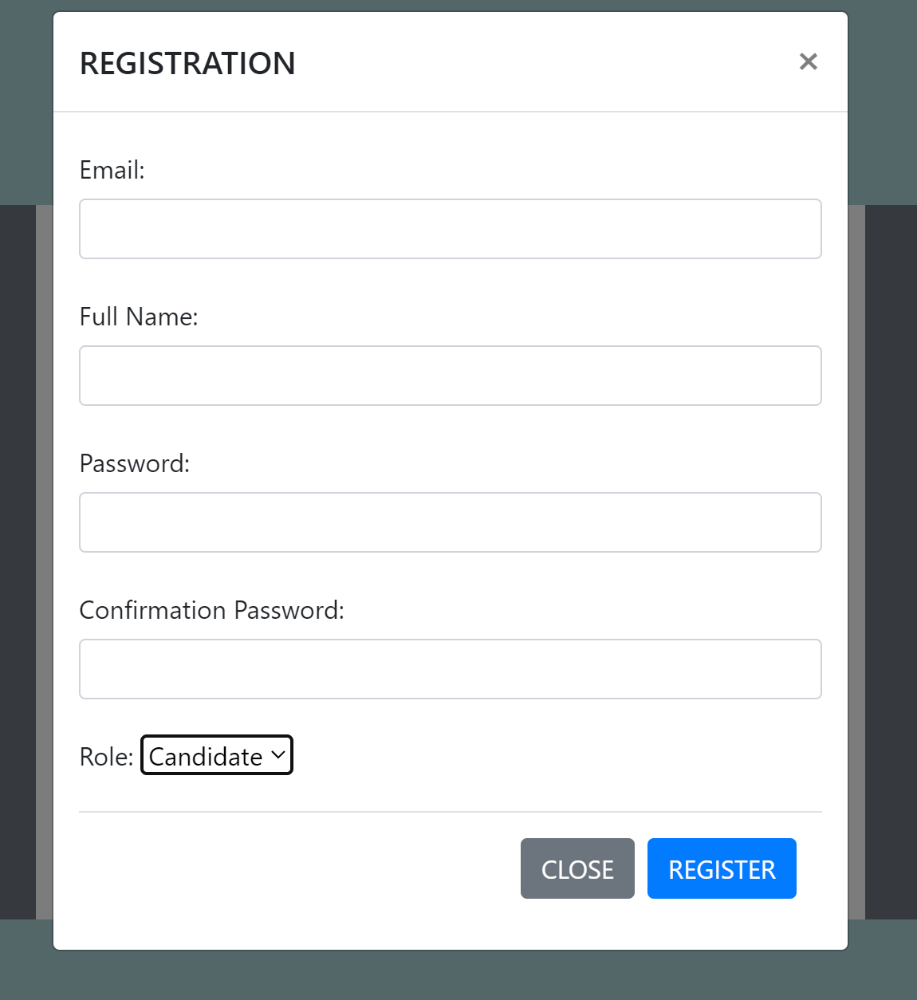

This application supports candidates and recruiters on job-hunting.
*Prerequisites:
pre1/Run Sql file: resources/static/job_hunting.sql

I/FUNDAMENTAL FUNCTIONS  
URL: http://localhost:8080/index -> Homepage that users have not logged in yet.

1/The Popular Companies
Show popular companies based on the position applied most or the most number of candidates  

2/The Popular Jobs  
Show popular jobs based on the position applied most or the most number of candidates or the best benefits

3/THE POPULAR CATEGORIES(ASP .NET, PHP,...)  
Show popular categories based on the position applied most  

---
II/RECRUITER'S FUNCTIONS  

4/Signup
Register a new account  
Form http://localhost:8080/log-in-page , click "Register" anchor link   
Fill register info in the form then click Register button
"Successfully registered..." shown in case of success  
Authenticated
Redirected to http://localhost:8080/home -> Homepage that users have logged in  
Validation for each field(in progress)  
  

5/Login
Log in as the role of RECRUITER to perform the authorized functions   
Click "Log in" button on homepage  
Redirected to http://localhost:8080/log-in-page  
Credentials will be compared to ones from database  
"Successfully logged in..." shown in case of success  

6/Authorization
Authorize users to perform the corresponding specified functions
Role: 1-RECRUITER, 2-CANDIDATE

7/Logout  
From main homepage, click "Log Out" button  
"You have been logged out!!!" shown  

7/Recruiter's and Company's Info Update  
Update recruiter's and company's Info by filling the form  
From main homepage, click "Personal Info" and choose one of 2 choices respectively  
Upload company's logo or user's image (After uploading images, click Update Button before submitting.)  
Validation for each field(in progress)  

8/Job Descriptions  
Show all of the job descriptions with the relative companies  
Click "Job Description List"

9/Job Descriptions Addition  
Recruiters post job descriptions and shows on homepage
Click "POST A NEW JOB" Button
Validation for each field(in progress)

  

10/Job Descriptions Update(in progress)  
Recruiters update job descriptions

11/Delete Job Descriptions(in progress)  
Recruiters delete job descriptions

12/Candidate List View(in progress)  
Recruiters view candidate list

---
III/CANDIDATE'S FUNCTIONS  
1/Signup(in progress)  
Sign up a new account

2/Login(in progress)  
Log in to home page

3/Logout(in progress)  
Log out from home page and return to index page

4/Refinement Search(in progress)  
Search the info by the refinements like the job's name or the company's name

5/Personal Info Update(in progress)  
Update the personal info

6/CV Upload(in progress)  
Upload the CV by PDF format

7/Job Application(in progress)  
Apply to the job that the candidate desires

---
IV/ADVANCED FUNCTIONS  
1/Account Authentication with sending email(in progress)  
2/Managing jobs being applied or done(in progress)  
3/List of jobs applied or saved(in progress)  
4/Managing history(in progress)
