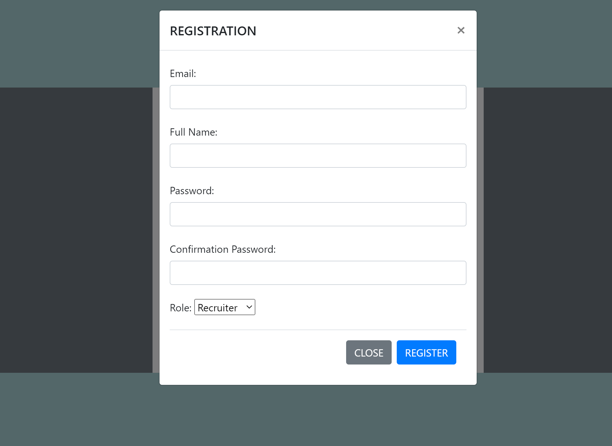
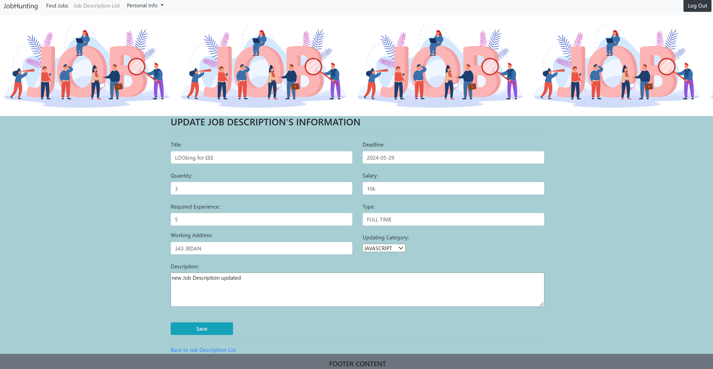
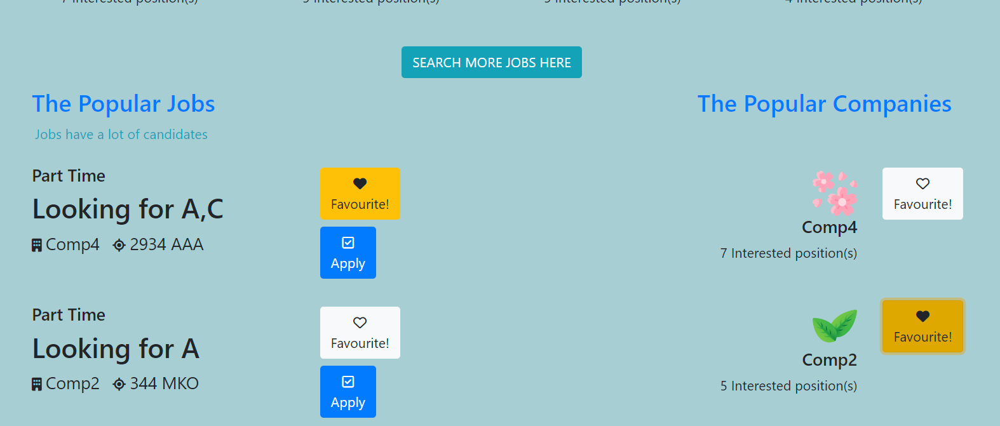

This application supports candidates and recruiters on job-hunting.
*Prerequisites:
pre1/Run Sql file: resources/static/job_hunting.sql

I/FUNDAMENTAL FUNCTIONS  
URL: http://localhost:8080/index -> Homepage that users have not logged in yet.

1/The Popular Companies
Show popular companies based on the position applied most or the most number of candidates  

2/The Popular Jobs  
Show popular jobs based on the position applied most or the most number of candidates or the best benefits

3/THE POPULAR CATEGORIES(ASP .NET, PHP,...)  
Show popular categories based on the position applied most  

---
II/RECRUITER'S FUNCTIONS  

4/Signup
Register a new account  
Form http://localhost:8080/log-in-page , click "Register" anchor link   
Fill register info in the form then click Register button  
"Successfully registered..." shown in case of success  
The registered user's role will be associated with the authority  
After clicking Register button, a spin icon will be appeared and spun  
If successfully registered, an activation token will be sent to email  
A unactivated email can not be logged in  
Redirected to http://localhost:8080/home -> Homepage that users have logged in  
Validation for each field(in progress)  

  

5/Login
Log in as the role of RECRUITER to perform the authorized functions   
Click "Log in" button on homepage  
Redirected to http://localhost:8080/log-in-page  
Credentials will be compared to ones from database  
"Successfully logged in..." shown in case of success  
Logging in as RECRUITER role will be email-authenticated with OTP before permitted to log in(in progress)   

6/Authorization
Authorize users to perform the corresponding specified functions
Role: 1-RECRUITER, 2-CANDIDATE

7/Logout  
From main homepage, click "Log Out" button  
Redirect to index page  

7/Recruiter's and Company's New Info  
Update recruiter's and company's Info by filling the form  
From main homepage, click "Personal Info" and choose one of 2 choices respectively  
Upload company's logo or user's image
Validation for each field(in progress)  

8/Job Descriptions  
Show all the job descriptions with the corresponding companies  
Click "Job Description List" and be redirected to "Job Description List" page  

!

9/Job Descriptions Addition  
Recruiters post job descriptions showing on homepage  
Click "POST A NEW JOB" Button  
Validation for each field(in progress)
  

10/Job Descriptions Update  
The recruiter updates job description's info
Click Update button of the corresponding job description, then be redirected to "UPDATE JOB DESCRIPTION'S INFORMATION" page.    
After filling in the fields that need updating, click Save button to update the new info
    

11/Delete Job Descriptions 
Recruiters delete job descriptions by clicking Red Delete Button  
A confirmation popup will be shown  
The job description deleted will be disappeared from the list  

12/Candidate List View
Recruiters view candidate list applying for the corresponding job  
  

From the job description page, the recruiter can also see then the candidate applying for the job by clicking Candidate button  
The recruiter can download the candidate's Cv by clicking Download Button(in progress)  

If there are no any candidates applying for this job, the message will be shown  

13/ Downloading candidates' CV(in progress)  
Downloading the CVs from the candidates applying for the jobs

---
III/CANDIDATE'S FUNCTIONS  
1/Signup 
Sign up a new account with CANDIDATE role  
After clicking Register button, a spin icon will be appeared and spun  
If successfully registered, an activation token will be sent to email  
A unactivated email can not be logged in  
Redirected to http://localhost:8080/home -> Homepage that users have logged in  
Validation for each field(in progress)  
  

2/Login 
Log in to home page as CANDIDATE role  
After log in as CANDIDATE role, there are operations only performed by CANDIDATE roles
  

3/Logout  
Log out from home page and return to index page  
  
  

4/Refinement Search  
Searching the info by the refinements like the job's name,salary, position,the company's name, the company's email, the company's address and so on  
Searching by given conditions separately without "Search button" (in progress)

5/Personal Info Update 
Click "Candidate's Info" on navigation menu to update candidate's information  

6/CV Upload  
Uploading the CV with the PDF file or so on  
Upload button is to accept and prepare for submitting  
Cancel button is to cancel the file chosen  

7/Job Application 
Apply to the job that the candidate desires  
Click Apply button for applying for the job to which the candidate want  
There will be 2 choices for submitting the CV(submitting a new one or using the present one that uploading by uploading personal info)  

---
IV/ADVANCED FUNCTIONS  

1/Account Authentication been just registered by sending email  
Reference "II/RECRUITER'S FUNCTIONS -> 4/Signup"  

2/Adding to Favourite List (Following Jobs or Companies)  
Click Favorite button for the 1st time to add the favourite jobs or companies that the candidate feels interested, the icon will be a yellow background with a black heart  
Click Favorite button for the 2nd time to remove the favorite jobs or companies that the candidate doesn't feel interested anymore the icon will return to the white background with a border-blacked empty heart  

3/List of jobs applied or saved(in progress)  

4/Managing history(in progress)

------
V/UNIT TEST(in progress)

Test Cases will be created and tested by using JUnit,... (in progress)
