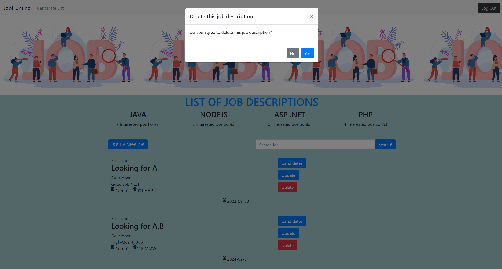
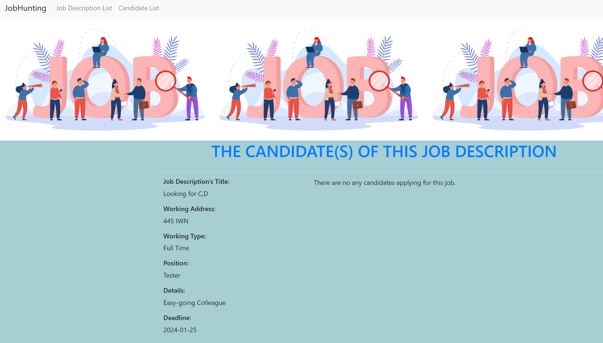

This application supports candidates and recruiters on job-hunting.
*Prerequisites:
pre1/Run Sql file: resources/static/job_hunting.sql

I/FUNDAMENTAL FUNCTIONS  
URL: http://localhost:8080/home  -> Homepage that users have not logged in yet.

1/The Popular Companies
Shows popular companies based on the position applied most or the most number of candidates  

2/The Popular Jobs  
Shows popular jobs based on the position applied most or the most number of candidates or the best benefits

3/THE POPULAR CATEGORIES(ASP .NET, PHP,...)  
Shows popular categories based on the position applied most

---
II/RECRUITER'S FUNCTIONS  

4/Logging in
Logs in as the role of RECRUITER to perform the authorized functions   
Click "Log in" button on homepage  
Redirected to http://localhost:8080/logInPage  
Credentials will be compared to ones from database  
"Successfully logged in..." shown in case of success  

5/Signing up
Register a new account  
Form http://localhost:8080/logInPage , click "Register" anchor link   
Fill register info in the form then click Register button
"Successfully registered..." shown in case of success   
Redirected to http://localhost:8080/main-home -> Homepage that users have logged in  

6/Logging out  
From main homepage, click "Log Out" button  
"You have been logged out!!!" shown

7/Recruiter's and Company's Info Update  
Update recruiter's and company's Info by filling the form  
From main homepage, click "Personal Info" and choose one of 2 choices respectively  
Upload logo or image(in progress)  
Validation for each field(in progress)  

8/Job Descriptions  
Shows all of the job descriptions with the relative companies

9/Job Descriptions Addition(UI: done, Logic: in progress)  
Recruiters post job descriptions and shows on homepage

10/Job Descriptions Update(in progress)  
Recruiters update job descriptions

11/Delete Job Descriptions(in progress)  
Recruiters delete job descriptions

12/Candidate List View(in progress)  
Recruiters view candidate list

---
III/CANDIDATE'S FUNCTIONS  
5 functions in total (in progress)
---
IV/ADVANCED FUNCTIONS  
1/Account Authentication with sending email(in progress)  
2/Managing jobs being applied or done(in progress)  
3/List of jobs applied or saved(in progress)  
4/Managing history(in progress)
